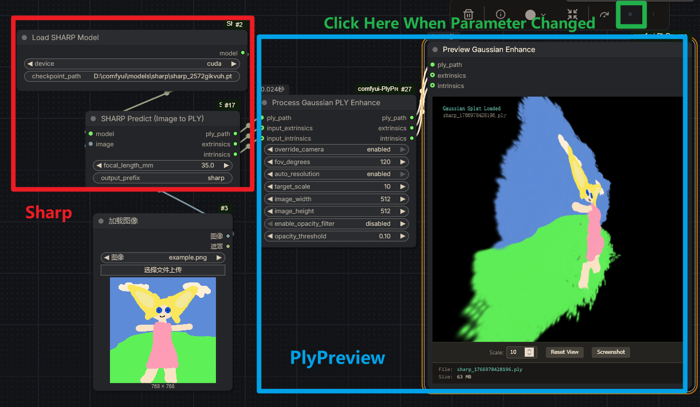
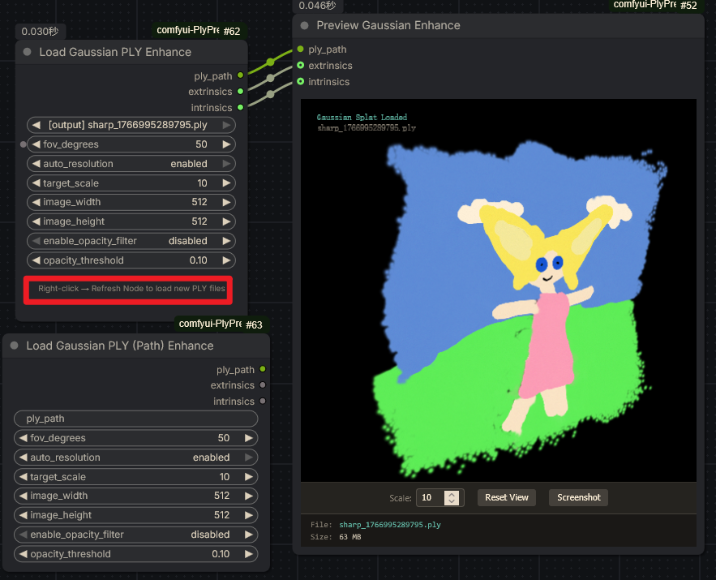

# ComfyUI PlyPreview

[中文](README.md) | [English](README.en.md)

Gaussian Splat PLY 加载与预览节点，独立于 GeometryPack，内置 gsplat.js 前端查看器。

## 节点
- Load Gaussian PLY：从 `input/`、`input/3d`、`output/` 下拉选择，支持自动分辨率、FOV 10–180°、可选透明度过滤。
- Load Gaussian PLY (Path)：手动输入路径，具备同样的相机/自动分辨率选项。
- Process Gaussian PLY：接收上游 `ply_path`（如 SHARP Predict），可覆盖相机或启用透明度过滤。
- Preview Gaussian：gsplat.js WebGL 预览，提供缩放、重置、截图和信息面板。

## 特性
- 自动分辨率：基于 FOV + target_scale，16 像素对齐，校准系数 0.8。
- 透明度过滤：sigmoid 后按阈值过滤，减少背景噪点。
- 输出相机内外参，预览一致性更好。
- 宽 FOV（10–180°）含鱼眼场景。
- 前端资源全部内置于 `web/`，无需外部依赖。

## 安装（Git clone）
```bash
cd ComfyUI/custom_nodes
git clone https://github.com/XuanYu-github/comfyui-PlyPreview.git
```
重启 ComfyUI。

## 安装（ComfyUI Manager）
在 Manager 中搜索 “comfyui-PlyPreview” 安装（内置 `comfyui_extension.json` 可被识别）。

## 使用方法
1) 选择 Load 或 Process 节点，生成 `ply_path`、`extrinsics`、`intrinsics`。
2) 连接 Preview Gaussian，执行后 iframe 显示控制条（Scale、Reset View、Screenshot）和信息面板。
3) 若启用透明度过滤，会在源旁生成 `_opacity{threshold}.ply`。

示例：





## 依赖
- ComfyUI（默认已启用 DOM widgets）。
- Python：`plyfile`、`numpy`（缺失时 `pip install plyfile numpy`）。

## 备注
- `WEB_DIRECTORY = "web"`，ComfyUI 会自动加载前端。
- 节点前缀 `PlyPreview*`，避免与 GeometryPack 冲突。
- 继承原 GeometryPack 的 GPL-3.0 许可。

## 许可
GPL-3.0-or-later。详见 [LICENSE](LICENSE)。
